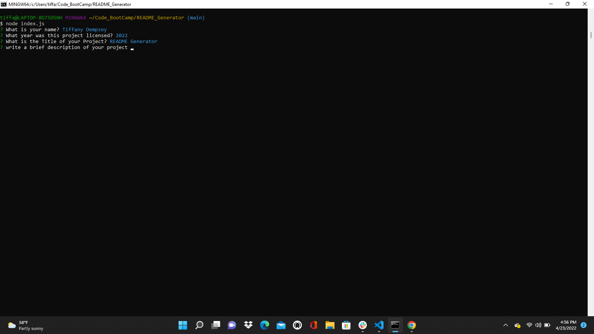
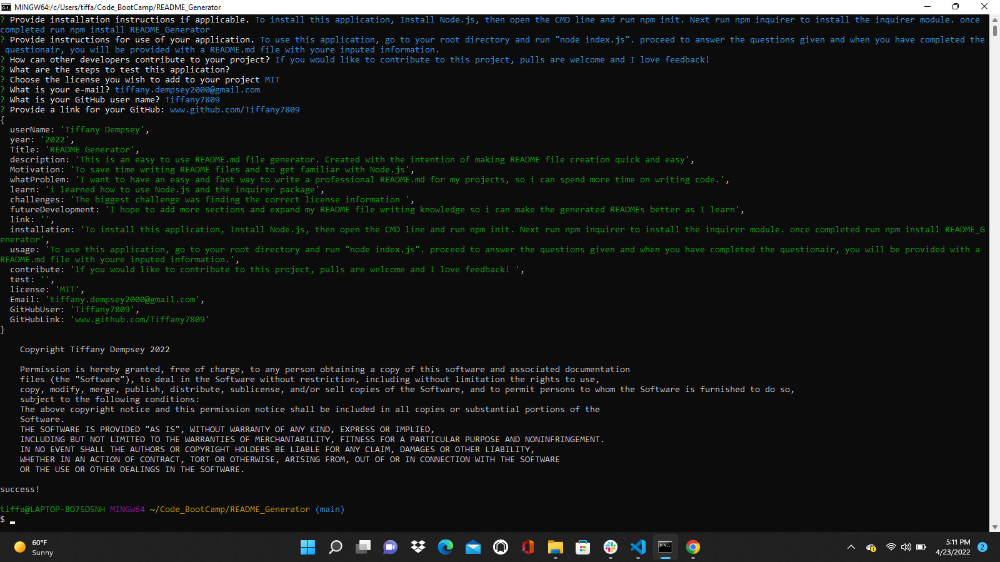

# README Generator 

## Table of Contents

<a href="#description">1.Description </a>

<a href="#install">2.Installation </a>

<a href="#use">3.Usage </a>

<a href="#contribute">4.Contributing </a>

<a href="#license">5.License </a>

<a href="#test">6.Tests </a>

<a href="#questions">7.Questions </a>

<h2 id="describe">Description</h2>

This application was created using Node.Js and the inquirer module. 
My aim was to create an easy to use and simple README generator, that users can open in their command terminal. 
This application allows the user to enter in their README information, via prompts given in the command terminal, and have 
their input transfered into a professional README.md file. 
This allows users to spend more time on their code, and less time on creating a README file.

<h2 id="install">Installation</h2>
To install this application:

1. Download Node.js
2. Download this module
3. In the cmd line, navigate to the root directory and run "npm init"
4. Then run "npm i" to install the inquirer

<h2 id="use">Usage</h2>
To use this application navigate to the root directory in the module, then run node index.js to begin the Questions.
Answer the questions with detailed answers and when completed your answers will be output into a README document.

</img> 

</img>

Here is a Video of how to use this program: 

<h2 id="questions">Questions</h2>

If you have any questions, please feel free to E-mail me at tiffany.dempsey2000@gmail.com

Or reach out to me via GitHub
Tiffany7809
https://github.com/Tiffany7809
 

<h2 id="license">License</h2>

